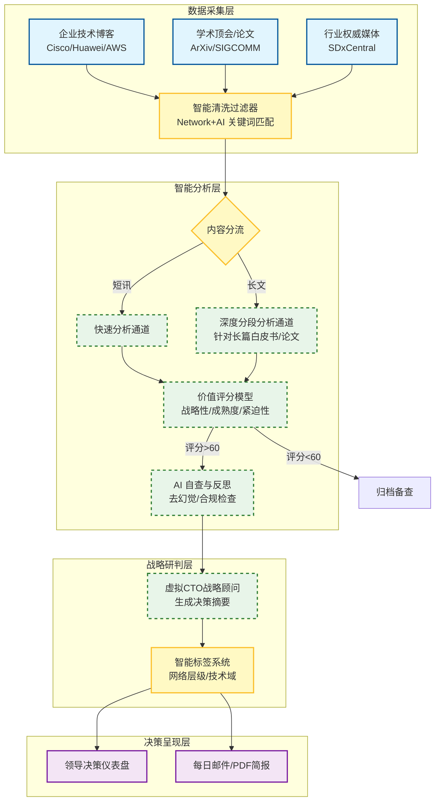
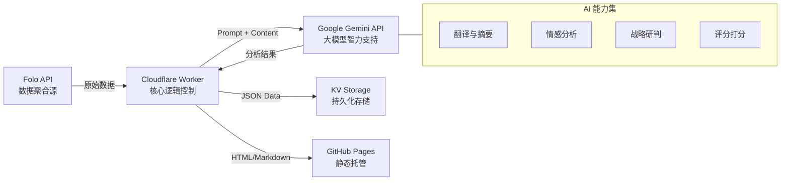
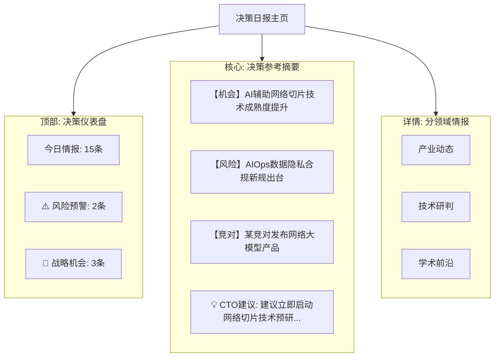

# 网络智能化决策日报系统 - 方案设计图解

本文档提供了系统的核心架构图和业务流程图，便于领导层快速理解方案设计。

## 1. 总体业务流程图 (Business Process Flow)

展示数据如何从采集到最终呈现给领导的全过程。

---

## 2. 核心功能模块架构 (System Architecture)

展示系统的技术组件及其交互关系。

---

## 3. 决策日报界面原型 (UI Prototype)

展示领导看到的最终界面结构（倒金字塔设计）。

